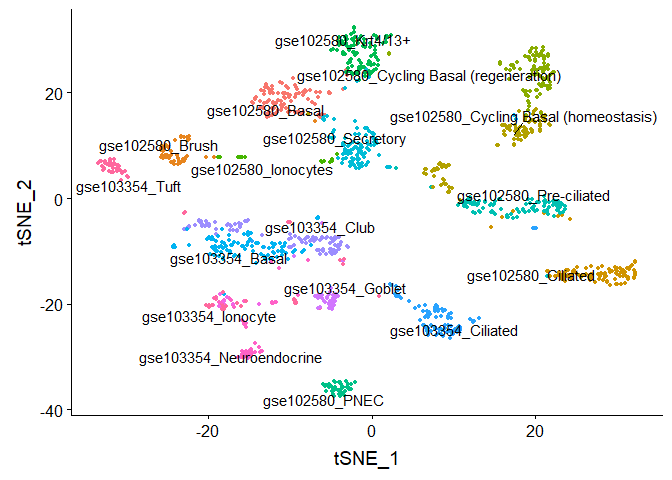
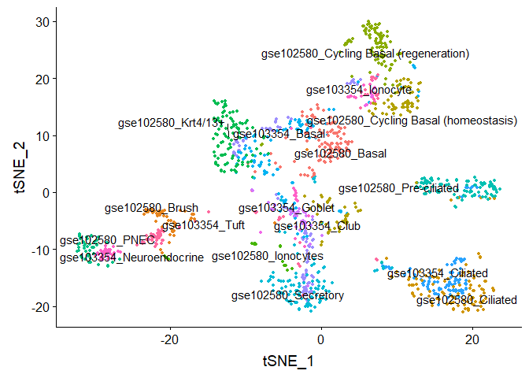

 Alignment of scRNA-seq data from the mouse airway epithelium

In this section, we will learn how to take two separate datasets and "integrate" them, so that cells of the same type (across datasets) roughly fall into the same region of the scatterplots (instead of separating by dataset first). Integration is typically done in a few different scenarios, e.g., 1) if you collect data from across multiple conditions / days / batches / experimentalists / etc. and you want to remove these technical confounders, 2) if you are doing a case control study (as we are here) and you want to identify which cells match across condition, or 3) you have performed an experiment sequencing cells from a tissue (e.g. lung epithelium) and you want to label the cells by type, but you don't have marker genes available, however, you do have access to a database of annotated cells that you could map onto your dataset.

Here we will perform alignment as if we do not have any labels (case 3), but we will use the labels after alignment to check its accuracy. The following R markdown illustrates how to do integration with Seurat, and aligns two datasets pretty successfully.

Let's take a quick peek to see what cell types are annotated in each study.


```r
library(Seurat)
```

<div class='r_output'> Registered S3 method overwritten by 'R.oo':
   method        from       
   throw.default R.methodsS3
</div>
```r
library(ggplot2)
library(cowplot)
```

<div class='r_output'> 
 Attaching package: 'cowplot'
</div>
<div class='r_output'> The following object is masked from 'package:ggplot2':
 
     ggsave
</div>
```r
# ASSIGNMENT 3 modify here

#download.file('https://ucdavis.box.com/shared/static/0nseizn5no45gbr5tsiks7lqz1ziixx7.rdata','scRNA.workshop.alignment.airway.rdata', mode='wb')
load('scRNA.workshop.alignment.airway.rdata')

levels(factor(gse103354.data@meta.data$type))
```

<div class='r_output'> [1] "gse103354_Basal"          "gse103354_Ciliated"      
 [3] "gse103354_Club"           "gse103354_Goblet"        
 [5] "gse103354_Ionocyte"       "gse103354_Neuroendocrine"
 [7] "gse103354_Tuft"
</div>
```r
levels(factor(gse102580.data@meta.data$type))
```

<div class='r_output'>  [1] "gse102580_Basal"                       
  [2] "gse102580_Brush"                       
  [3] "gse102580_Ciliated"                    
  [4] "gse102580_Cycling Basal (homeostasis)" 
  [5] "gse102580_Cycling Basal (regeneration)"
  [6] "gse102580_Ionocytes"                   
  [7] "gse102580_Krt4/13+"                    
  [8] "gse102580_PNEC"                        
  [9] "gse102580_Pre-ciliated"                
 [10] "gse102580_Secretory"
</div>
```r
#rename datasets to make cross-species alignment (below) easier
dataset1 = gse103354.data;
dataset2 = gse102580.data;
dataset1name = 'gse103354';
dataset2name = 'gse102580';
projectname = 'airwayepithelia';

#try this later:
#gse102580.data = removeCellType(gse102580.data, cellTypeToRemove = 'gse102580_Ciliated')
```


Now we will visualize the data without alignment.


```r
# speed up alignment by subsetting data to at most 100 cells per type.
# ASSIGNMENT 1 modify here
dataset1 <- setMaxNumCellsPerType(dataset1, maxNumCells=100);
dataset2 <- setMaxNumCellsPerType(dataset2, maxNumCells=100);

gse.combined <- merge(x = dataset1, y = dataset2, add.cell.ids = c(dataset1name, dataset2name), project = projectname)

gse.combined <- ScaleData(object = gse.combined)
```

<div class='r_output'> Centering and scaling data matrix
</div>
```r
gse.combined <- FindVariableFeatures(object = gse.combined, selection.method = "vst", nfeatures = 2000, verbose = FALSE)

gse.combined <- RunPCA(object = gse.combined, npcs = 30, verbose = FALSE)

#Run TSNE, coloring cells by which dataset they came from
gse.combined <- RunTSNE(object = gse.combined, reduction = "pca", dims = 1:20)
DimPlot(object = gse.combined, reduction = "tsne", group.by = "stim", label = TRUE, repel = TRUE) + NoLegend()
```

<div class='r_output'> Warning: Using `as.character()` on a quosure is deprecated as of rlang 0.3.0.
 Please use `as_label()` or `as_name()` instead.
 This warning is displayed once per session.
</div>
<!-- -->

```r
#Run TSNE, coloring cells by "cell type"
gse.combined <- RunTSNE(object = gse.combined, reduction = "pca", dims = 1:20)
DimPlot(object = gse.combined, reduction = "tsne", group.by = "type", label = TRUE, repel = TRUE) + NoLegend()
```

<!-- -->

```r
rm(gse.combined)
```
  

[FUTURE] ComBat and Seurat (regress) batch correction results.
  


Now visualize after alignment.
  

```r
  #find anchors
reference.list <- list(dataset1,dataset2)
names(reference.list) <- c(dataset1name, dataset2name)

# ASSIGNMENT 2 modify here
compData.anchors <- FindIntegrationAnchors(object.list = reference.list, dims = 1:2, k.anchor = 5, k.filter = 200, k.score = 30)
```

<div class='r_output'> Computing 2000 integration features
</div>
<div class='r_output'> Scaling features for provided objects
</div>
<div class='r_output'> Finding all pairwise anchors
</div>
<div class='r_output'> Running CCA
</div>
<div class='r_output'> Merging objects
</div>
<div class='r_output'> Finding neighborhoods
</div>
<div class='r_output'> Finding anchors
</div>
<div class='r_output'> 	Found 2065 anchors
</div>
<div class='r_output'> Filtering anchors
</div>
<div class='r_output'> 	Retained 1511 anchors
</div>
<div class='r_output'> Extracting within-dataset neighbors
</div>
```r
compData.integrated <- IntegrateData(anchorset = compData.anchors, dims = 1:30)
```

<div class='r_output'> Merging dataset 1 into 2
</div>
<div class='r_output'> Extracting anchors for merged samples
</div>
<div class='r_output'> Finding integration vectors
</div>
<div class='r_output'> Finding integration vector weights
</div>
<div class='r_output'> Integrating data
</div>
```r
rm(reference.list, compData.anchors)

DefaultAssay(object = compData.integrated) <- "integrated"

#visualize
  
# Run the standard workflow for visualization and clustering
compData.integrated <- ScaleData(object = compData.integrated, verbose = FALSE)
compData.integrated <- RunPCA(object = compData.integrated, npcs = 30, verbose = FALSE)

#Run TSNE on integrated data, coloring cells by which dataset they came from
compData.integrated <- RunTSNE(object = compData.integrated, reduction = "pca", dims = 1:30)
DimPlot(object = compData.integrated, reduction = "tsne", group.by = "stim", label = TRUE, 
              repel = TRUE) + NoLegend()
```

<!-- -->

```r
#Run TSNE on integrated data, coloring cells by "cell type"
DimPlot(object = compData.integrated, reduction = "tsne", group.by = "type", label = TRUE, 
              repel = TRUE) + NoLegend()
```

<!-- -->

 Group assignment 1

Check how well Seurat can align the correct cell types, when the cell types are more evenly distributed (e.g. the Basal cells are not overrepresented in the data). Hint: do a search in this Rmd file for 'ASSIGNMENT 1 modify here', and set maxNumCells=25 or something small.

 Group assignment 2

Check the help of FindIntegrationAnchors. What happens when you change dims, k.anchor, k.filter and k.score. What about the dims argument of RunTSNE?  Hint: do a search in this Rmd file for 'ASSIGNMENT 2 modify here'.

 Group assignment 3

Try aligning single cells across the human and mouse cortex ( Hint: do a search in this Rmd file for 'ASSIGNMENT 3 modify here'.):

```r
#download.file('https://ucdavis.box.com/shared/static/ud4zh4ynpd7avemk3gqfva3nmqurk7ld.rdata','allen.expr.rdata', mode='wb')
load('allen.expr.rdata')
```

 Discussion points

When does alignment work well? (e.g. what were the results of Assignment 1?)
Statistical significance?
When does alignment make sense?
How do you know when alignment makes sense?

 More reading

For a larger list of alignment methods, as well as an evaluation of them, see our preprint here: https://www.biorxiv.org/content/10.1101/504944v6 . As a side note, some of the benefits of scAlign compared to most other methods include:

* ability to 'project' data from aligned space back to UMI/count space (for post-analysis). 
* ability to use partial labeling of cells to improve alignment - e.g. suppose only some cells can be labeled using high confidence markers.
