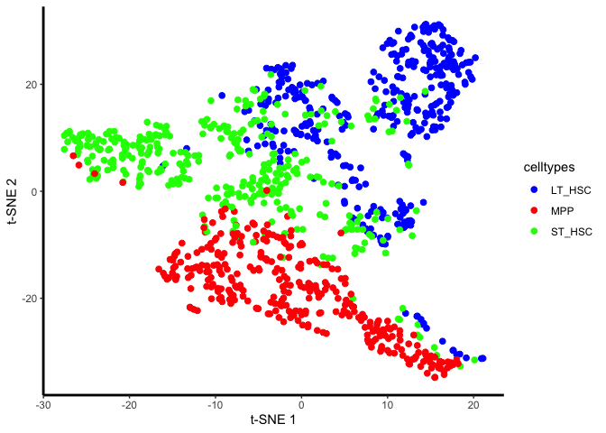
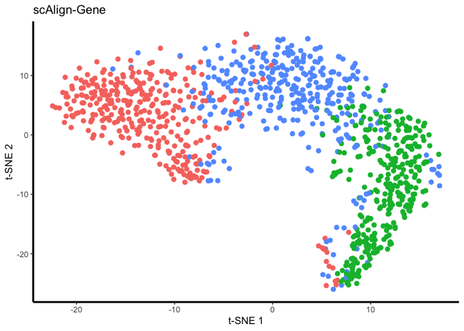
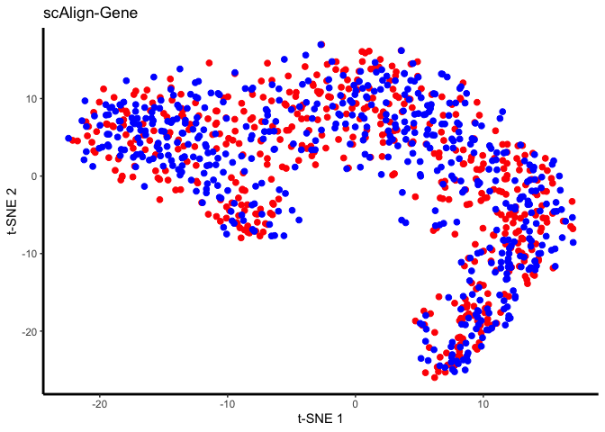
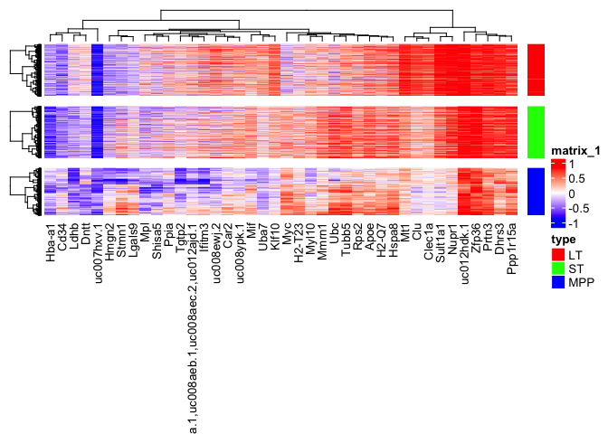
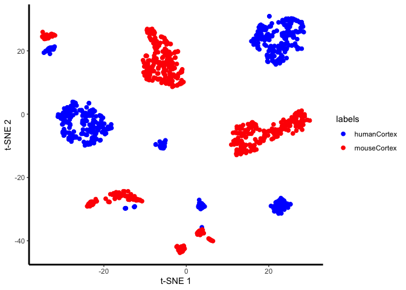
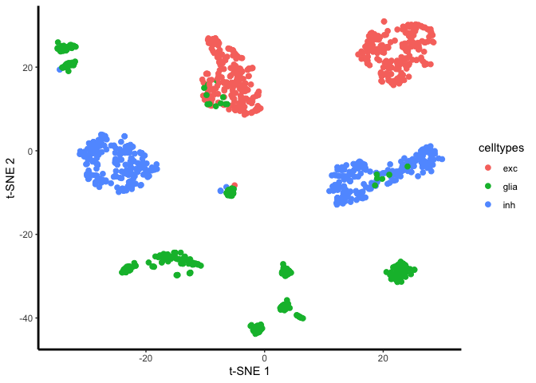
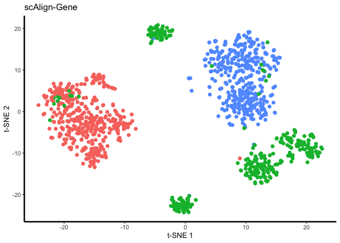
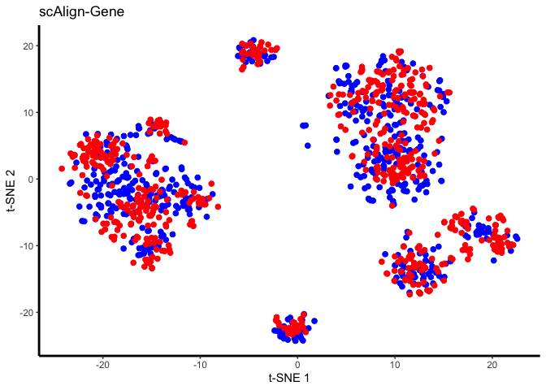

## Overview

In this section, we will learn how to use the method [scAlign](https://genomebiology.biomedcentral.com/articles/10.1186/s13059-019-1766-4) to take two separate datasets and "integrate" them, so that cells of the same type (across datasets) roughly fall into the same region of the scatterplots (instead of separating by dataset first). Integration is typically done in a few different scenarios, e.g., 1) if you collect data from across multiple conditions / days / batches / experimentalists / etc. and you want to remove these technical confounders, 2) if you are doing a case control study (as we are here) and you want to identify which cells match across condition, or 3) you have performed an experiment sequencing cells from a tissue (e.g. lung epithelium) and you want to label the cells by type, but you don't have marker genes available, however, you do have access to a database of annotated cells that you could map onto your dataset.

Here we will perform alignment as if we do not have any labels (case 3), but we will use the labels after alignment to check its accuracy. The following R markdown illustrates how to do integration with scAlign, and aligns two datasets pretty successfully.

This tutorial provides a guided alignment for two groups of cells from [Kowalczyk et al, 2015](https://www.ncbi.nlm.nih.gov/pubmed/26430063). In this experiment, single cell RNA (scRNA) sequencing profiles were generated from HSCs in young (2-3 mo) and old (>22 mo) C57BL/6 mice. Age related expression programs make a joint analysis of three isolated cell types long-term (LT), short-term (ST) and multipotent progenitors (MPPs). In this tutorial we demonstrate the unsupervised alignment strategy of scAlign described in Johansen et al, 2018 along with typical analysis utilizing the aligned dataset, and show how scAlign can identify and match cell types across age without using the labels as input.

## Alignment goals
The following is a walkthrough of a typical alignment problem for scAlign and has been designed to provide an overview of data preprocessing, alignment and finally analysis in our joint embedding space. Here, our primary goals include:

1. Learning a low-dimensional cell state space in which cells group by function and type, regardless of condition (age).
2. Computing a single cell paired differential expression map from paired cell projections.

First, we perform a typical scRNA preprocessing step using the Seurat package. Then, reduce to the top 3,000 highly variable genes from both datasets to improve convergence and reduce computation time.


```r
## User paths
working.dir = "." #where our data file, kowalcyzk_gene_counts.rda is located
results.dir = "." #where the output should be stored

## Load in data - either option
download.file('https://github.com/quon-titative-biology/examples/raw/master/scAlign_paired_alignment/kowalcyzk_gene_counts.rda','kowalcyzk_gene_counts.rda'); load('kowalcyzk_gene_counts.rda')
#load(url('https://github.com/quon-titative-biology/examples/raw/master/scAlign_paired_alignment/kowalcyzk_gene_counts.rda'))

## Extract age and cell type labels
cell_age = unlist(lapply(strsplit(colnames(C57BL6_mouse_data), "_"), "[[", 1))
cell_type = gsub('HSC', '', unlist(lapply(strsplit(colnames(C57BL6_mouse_data), "_"), "[[", 2)))

## Separate young and old data
young_data = C57BL6_mouse_data[unique(row.names(C57BL6_mouse_data)),which(cell_age == "young")]
old_data   = C57BL6_mouse_data[unique(row.names(C57BL6_mouse_data)),which(cell_age == "old")]

## Set up young mouse Seurat object
youngMouseSeuratObj <- CreateSeuratObject(counts = young_data, project = "MOUSE_AGE", min.cells = 0)
youngMouseSeuratObj <- NormalizeData(youngMouseSeuratObj)
youngMouseSeuratObj <- ScaleData(youngMouseSeuratObj, do.scale=T, do.center=T, display.progress = T)
```

```
## Warning: The following arguments are not used: display.progress
```

```
## Suggested parameter: verbose instead of display.progress
```

```
## Centering and scaling data matrix
```

```r
## Set up old mouse Seurat object
oldMouseSeuratObj <- CreateSeuratObject(counts = old_data, project = "MOUSE_AGE", min.cells = 0)
oldMouseSeuratObj <- NormalizeData(oldMouseSeuratObj)
oldMouseSeuratObj <- ScaleData(oldMouseSeuratObj, do.scale=T, do.center=T, display.progress = T)
```

```
## Warning: The following arguments are not used: display.progress
```

```
## Suggested parameter: verbose instead of display.progress
## 
## Centering and scaling data matrix
```

```r
## Gene selection
youngMouseSeuratObj <- FindVariableFeatures(youngMouseSeuratObj, do.plot = F, nFeature=3000)
```

```
## Warning: The following arguments are not used: do.plot, nFeature
```

```r
oldMouseSeuratObj <- FindVariableFeatures(oldMouseSeuratObj, do.plot = F, nFeature=3000,)
```

```
## Warning: The following arguments are not used: do.plot, nFeature
```

```r
#find the intersection of different variable gene lists
genes.use = Reduce(intersect, list(VariableFeatures(youngMouseSeuratObj),
                                   VariableFeatures(oldMouseSeuratObj),
                                   rownames(youngMouseSeuratObj),
                                   rownames(oldMouseSeuratObj)))

#[FUTURE] ComBat and Seurat (regress) batch correction results.
```

## Is alignment necessary?

Let's visualize the data from both young and old mice, to determine whether we need alignment/batch correction.


```r
## Combine our Seurat objects
hsc.combined <- merge(youngMouseSeuratObj, oldMouseSeuratObj, add.cell.ids = c("YOUNG", "OLD"), project = "HSC")
hsc.combined <- ScaleData(hsc.combined, do.scale=T, do.center=T, display.progress = T)
```

```
## Warning: The following arguments are not used: display.progress
```

```
## Suggested parameter: verbose instead of display.progress
```

```
## Centering and scaling data matrix
```

```r
VariableFeatures(hsc.combined) = genes.use

## Run PCA and TSNE
hsc.combined = RunPCA(hsc.combined, do.print=FALSE)
```

```
## PC_ 1 
## Positive:  Mpl, Pdzk1ip1, Mmrn1, Ifitm1, Txnip, Car2, uc008aea.1,uc008aeb.1,uc008aec.2,uc012ajd.1, Shisa5, Cd63, uc008ewj.2 
## 	   uc012hdk.1, Zfp36, Sult1a1, Tbxas1, uc008xuk.1, Ifitm3, uc008ypk.1, Tgm2, H2-T23, Nupr1 
## 	   Clec1a, Procr, Uba7, Apoe, Ppp1r15a, Sat1, Tsc22d3, Cd74, Krt18, Pygm 
## Negative:  Top2a, Pbk, Birc5, Mpo, Aurkb, Stmn1, uc009qeb.1, Cks1b, Cd48, Tk1 
## 	   Mcm5, Cdca8, Plac8, Kif11, Spc25, Ppia, Nusap1, H2afz, Kif22, Rrm2 
## 	   Tacc3, Prc1, Kif20a, Bub1b, Cdca3, Nkg7, Mcm7, Ckap2l, Hmgn2, Asf1b 
## PC_ 2 
## Positive:  Flt3, Cd34, Plac8, Wfdc17, Lat2, Ighv1-30, Gpr97, Serpinb1a, Emb, Tespa1 
## 	   Cd52, Tyrobp, Dntt, Il12a, Ccl3, Sell, Trf, Ncf1, Lsp1, H2-Ob 
## 	   uc008hln.1, Mpo, Bex6, Spns3, Cd48, uc007hxv.1, Haao, Cd33, Ubash3a, Ifi27l1 
## Negative:  Nusap1, Prc1, Birc5, Cdca8, Fam64a, Ckap2l, Hmmr, Kif22, Ube2c, Kif20a 
## 	   Cdca3, Aurkb, Kif11, Bub1b, Mmrn1, Tpx2, Ccnb1, Ccnb2, Apoe, Pbk 
## 	   Shcbp1, Kif2c, Nupr1, Cenpa, Aurka, Spc25, Cdkn3, Cdc20, Spag5, Tubb5 
## PC_ 3 
## Positive:  Mcm2, Ldha, Mif, Cdca7, Mcm5, Mcm6, Tipin, Lig1, Mcm3, Uhrf1 
## 	   Slc25a5, Slbp, Mcm7, Pcna, Gins2, Mt1, Cd63, Fen1, Ppia, Myc 
## 	   Tubb5, Sdf2l1, Apoe, Hspa8, Itga2b, Gmnn, Rfc4, Tuba1b, Ppil1, Clu 
## Negative:  Cdkn3, Ccnb2, Hmmr, Cenpa, Kif23, Ube2c, Kif2c, Kif20a, D2Ertd750e, Gimap6 
## 	   Ccnb1, Tpx2, uc007hxv.1, Fam64a, Mgst1, Cdc20, Ckap2l, Aurka, Cdca3, Nusap1 
## 	   Troap, Kif11, Cdc25b, Prc1, Ect2, D17H6S56E-5, Flt3, Cdca8, Psrc1, Kif22 
## PC_ 4 
## Positive:  Hba-a2, Hba-a1, Hbb-b2, Ebi3, Shisa5, Ly6a, Lig1, Tuba1b, Mcm3, Gins2 
## 	   Gbp6, Tk1, Uhrf1, Stat1, Mcm5, Tcf19, Mpl, Gbp9, Pcna, Ldhb 
## 	   Car2, Mcm7, Mcm6, Tipin, Rfc3, Tnfrsf18, Mamdc2, Gins1, Iigp1, Prim2 
## Negative:  uc012hdk.1, Dhrs3, uc008ewj.2, uc008aea.1,uc008aeb.1,uc008aec.2,uc012ajd.1, Fos, Gpr97, uc008ypk.1, Prtn3, Zfp36, Lat2 
## 	   Mpo, Cenpa, Nupr1, uc008hln.1, Dntt, Sult1a1, Cd48, Sell, Nkg7, Btg2 
## 	   Atp8b4, Clec1a, Ccnb2, Mt1, Sat1, D2Ertd750e, Bex6, Ctsg, Ighv1-30, Plk2 
## PC_ 5 
## Positive:  Car2, Ctla2b, uc008xuk.1, Muc13, Acap1, Itga2b, Mfsd2b, Gata1, uc007mja.2,uc007mjb.2, Esam 
## 	   Rnase6, Pf4, Mc5r, Itm2a, Tuba8, Cpa3, Gsta4, Sdsl, Cd63, Fam109b 
## 	   uc007zwh.1, Arntl, Rab38, Cdc20, Zbtb48, Ppic, Rgs1, Stard4, Armcx1, Phlda2 
## Negative:  Ighv1-30, Gbp4, Gbp6, Sult1a1, Gpx3, Dntt, Clec1a, Iigp1, Wfdc17, Clec12a 
## 	   Plk2, Emb, Stat1, Klrb1b, Tgtp2, Nupr1, Atp8b4, Gm4951, Tgtp1, Cd74 
## 	   Rorc, Clu, uc008muc.2, Cnn3, Gbp3, Flt3, Tpm4, Ehd3, Sdpr, Smtnl1
```

```r
hsc.combined = RunTSNE(hsc.combined, dims.use = 1:30, max_iter=2000)

#get cell type
celltypes = rownames(hsc.combined@meta.data)
celltypes[grep('MPP',celltypes)]='MPP'; celltypes[grep('ST_HSC',celltypes)]='ST_HSC'; celltypes[grep('LT_HSC',celltypes)]='LT_HSC'; celltypes=factor(celltypes);

## Plot tsne results
plot.me <- data.frame(x=hsc.combined@reductions$tsne@cell.embeddings[,1],
                      y=hsc.combined@reductions$tsne@cell.embeddings[,2],
                      labels=Idents(hsc.combined),
                      celltypes=celltypes,
                      stringsAsFactors=FALSE)


unaligned.plot <- ggplot(plot.me, aes(x=x, y=y, colour = labels)) +
                  geom_point(size=2) +
                  scale_colour_manual(values=c("blue", "red")) +
                  xlab('t-SNE 1') +
                  ylab('t-SNE 2') +
                  theme_bw() +
                  theme(panel.border = element_blank(),
                        panel.grid.major = element_blank(),
                        panel.grid.minor = element_blank(),
                        panel.background = element_rect(fill = "transparent"), # bg of the panel
                        plot.background = element_rect(fill = "transparent", color = NA),
                        axis.line = element_line(colour = 'black',size=1))
plot(unaligned.plot)
```

<!-- -->

```r
unaligned.plot <- ggplot(plot.me, aes(x=x, y=y, colour = celltypes)) +
                  geom_point(size=2) +
                  scale_colour_manual(values=c("blue", "red","green")) +
                  xlab('t-SNE 1') +
                  ylab('t-SNE 2') +
                  theme_bw() +
                  theme(panel.border = element_blank(),
                        panel.grid.major = element_blank(),
                        panel.grid.minor = element_blank(),
                        panel.background = element_rect(fill = "transparent"), # bg of the panel
                        plot.background = element_rect(fill = "transparent", color = NA),
                        axis.line = element_line(colour = 'black',size=1))
plot(unaligned.plot)
```

<!-- -->

Yes, there are definitely condition-specific clusters of cells in the tSNE, so we will go ahead with alignment.

## scAlign setup
The general design of `scAlign` makes it agnostic to the input RNA-seq data representation. Thus, the input data can either be
gene-level counts, transformations of those gene level counts or a preliminary step of dimensionality reduction such
as canonical correlates or principal component scores. Here we create the scAlign object from the previously defined
`Seurat` objects and perform both PCA and CCA on the unaligned data.


```r
## Create paired dataset SCE objects to pass into scAlignCreateObject
youngMouseSCE <- SingleCellExperiment(
    assays = list(counts = youngMouseSeuratObj@assays$RNA@counts[genes.use,],
                  logcounts  = youngMouseSeuratObj@assays$RNA@data[genes.use,],
                  scale.data = youngMouseSeuratObj@assays$RNA@scale.data[genes.use,])
)

oldMouseSCE <- SingleCellExperiment(
  assays = list(counts = oldMouseSeuratObj@assays$RNA@counts[genes.use,],
                logcounts  = oldMouseSeuratObj@assays$RNA@data[genes.use,],
                scale.data = oldMouseSeuratObj@assays$RNA@scale.data[genes.use,])
)
```
We now build the scAlign SCE object and compute PCs and/or CCs using Seurat for the assay defined by `data.use`. It is assumed that `data.use`, which is being used for the initial step of dimensionality reduction, is properly normalized and scaled. 
Resulting combined matrices will always be ordered based on the sce.objects list order.


```r
scAlignHSC = scAlignCreateObject(sce.objects = list("YOUNG"=youngMouseSCE, "OLD"=oldMouseSCE),
                                 labels = list(cell_type[which(cell_age == "young")], cell_type[which(cell_age == "old")]),
                                 data.use="scale.data",
                                 pca.reduce = TRUE,
                                 pcs.compute = 50,
                                 cca.reduce = TRUE,
                                 ccs.compute = 15,
                                 project.name = "scAlign_Kowalcyzk_HSC")
```

```
## [1] "Computing partial PCA for top  50  PCs."
## [1] "Computing CCA using Seurat."
```

```
## Centering and scaling data matrix
## Centering and scaling data matrix
```

```
## Running CCA
```

```
## Merging objects
```

```
## Warning: The following arguments are not used: scale.data
```

## Alignment of young and old HSCs
Now we align the young and old cpopulations for multiple input types which are specified by `encoder.data`. `scAlign` returns a 
low-dimensional joint embedding space where the effect of age is removed allowing us to use the complete dataset for downstream analyses such as clustering or differential expression. For the gene level input we also run the decoder procedure which projects each cell into logcount space for both conditions to perform paired single cell differential expressional.


```r
## Run scAlign with high_var_genes as input to the encoder (alignment) and logcounts with the decoder (projections).
scAlignHSC = scAlign(scAlignHSC,
                    options=scAlignOptions(steps=3000, steps.decoder=500, log.every=100, norm=TRUE, batch.norm.layer=TRUE, early.stop=FALSE, architecture="small"),
                    encoder.data="scale.data",
                    decoder.data="logcounts",
                    supervised='none',
                    run.encoder=TRUE,
                    run.decoder=TRUE,
                    log.dir=file.path(results.dir, 'models','gene_input'),
                    device="CPU")
```

```
## [1] "============== Step 1/3: Encoder training ==============="
## [1] "Graph construction"
## [1] "Adding source walker loss"
## [1] "Adding target walker loss"
## [1] "Done random initialization"
## [1] "Step: 1    Loss: 16.261"
## [1] "Step: 100    Loss: 11.645"
## [1] "Step: 200    Loss: 10.3631"
## [1] "Step: 300    Loss: 10.1158"
## [1] "Step: 400    Loss: 9.7146"
## [1] "Step: 500    Loss: 9.6141"
## [1] "Step: 600    Loss: 9.5061"
## [1] "Step: 700    Loss: 9.3829"
## [1] "Step: 800    Loss: 9.3852"
## [1] "Step: 900    Loss: 9.3153"
## [1] "Step: 1000    Loss: 9.2133"
## [1] "Step: 1100    Loss: 9.2236"
## [1] "Step: 1200    Loss: 9.1493"
## [1] "Step: 1300    Loss: 9.1768"
## [1] "Step: 1400    Loss: 9.1676"
## [1] "Step: 1500    Loss: 9.0259"
## [1] "Step: 1600    Loss: 9.1421"
## [1] "Step: 1700    Loss: 9.0846"
## [1] "Step: 1800    Loss: 9.0709"
## [1] "Step: 1900    Loss: 9.1625"
## [1] "Step: 2000    Loss: 8.9688"
## [1] "Step: 2100    Loss: 9.0195"
## [1] "Step: 2200    Loss: 9.0779"
## [1] "Step: 2300    Loss: 9.0278"
## [1] "Step: 2400    Loss: 9.0322"
## [1] "Step: 2500    Loss: 9.0471"
## [1] "Step: 2600    Loss: 9.0613"
## [1] "Step: 2700    Loss: 9.0827"
## [1] "Step: 2800    Loss: 9.0029"
## [1] "Step: 2900    Loss: 9.0413"
## [1] "Step: 3000    Loss: 8.9674"
## [1] "============== Alignment Complete =============="
## [1] "============== Step 2/3: YOUNG decoder training ==============="
## [1] "Graph construction"
## [1] "Done random initialization"
## [1] "Step: 1    Loss: 0.5651"
## [1] "Step: 100    Loss: 0.4357"
## [1] "Step: 200    Loss: 0.3531"
## [1] "Step: 300    Loss: 0.3063"
## [1] "Step: 400    Loss: 0.2802"
## [1] "Step: 500    Loss: 0.269"
## [1] "============== Step 3/3: OLD decoder training ==============="
## [1] "Graph construction"
## [1] "Done random initialization"
## [1] "Step: 1    Loss: 0.5682"
## [1] "Step: 100    Loss: 0.4295"
## [1] "Step: 200    Loss: 0.3453"
## [1] "Step: 300    Loss: 0.2926"
## [1] "Step: 400    Loss: 0.2746"
## [1] "Step: 500    Loss: 0.2624"
```

```r
## Additional run of scAlign with PCA, the early.stopping heuristic terminates the training procedure too early with PCs as input so it is disabled.
# scAlignHSC = scAlign(scAlignHSC,
#                     options=scAlignOptions(steps=500, log.every=100, norm=TRUE, batch.norm.layer=TRUE, early.stop=FALSE),
#                     encoder.data="PCA",
#                     supervised='none',
#                     run.encoder=TRUE,
#                     run.decoder=FALSE,
#                     log.dir=file.path(results.dir, 'models','pca_input'),
#                     device="CPU")
# 
# ## Additional run of scAlign with CCA
# scAlignHSC = scAlign(scAlignHSC,
#                     options=scAlignOptions(steps=500, log.every=100, norm=TRUE, batch.norm.layer=TRUE, early.stop=TRUE),
#                     encoder.data="CCA",
#                     supervised='none',
#                     run.encoder=TRUE,
#                     run.decoder=FALSE,
#                     log.dir=file.path(results.dir, 'models','cca_input'),
#                     device="CPU")
```

Now visualize:


```r
## Plot aligned data in tSNE space, when the data was processed in three different ways: 1) either using the original gene inputs, 2) after PCA dimensionality reduction for preprocessing, or 3) after CCA dimensionality reduction for preprocessing. Cells here are colored by input labels
set.seed(5678)

#try changing the line below to "ALIGNED-PCA" or "ALIGNED-CCA" to check how alignment using just PCs or CCAs worked
DATA_TO_PLOT = 'ALIGNED-GENE';

tsne.res = Rtsne(reducedDim(scAlignHSC, "ALIGNED-GENE"), perplexity=30)
plot.me <- data.frame(x=tsne.res$Y[,1],
                      y=tsne.res$Y[,2],
                      labels=as.character(colData(scAlignHSC)[,"scAlign.labels"]),
                      stringsAsFactors=FALSE)
gene_plot <- ggplot(plot.me, aes(x=x, y=y, colour = labels)) +
                 geom_point(size=2) +
                 #scale_colour_manual(values=c("blue", "red")) +
                 xlab('t-SNE 1') +
                 ylab('t-SNE 2') +
                 ggtitle("scAlign-Gene") +
                 theme_bw() +
                 theme(panel.border = element_blank(),
                       panel.grid.major = element_blank(),
                       panel.grid.minor = element_blank(),
                       panel.background = element_rect(fill = "transparent"), # bg of the panel
                       plot.background = element_rect(fill = "transparent", color = NA),
                       legend.position="none",
                       axis.line = element_line(colour = 'black',size=1))
plot(gene_plot);
```

<!-- -->

```r
set.seed(5678)

tsne.res = Rtsne(reducedDim(scAlignHSC, "ALIGNED-GENE"), perplexity=30)
plot.me <- data.frame(x=tsne.res$Y[,1],
                      y=tsne.res$Y[,2],
                      labels=as.character(colData(scAlignHSC)[,"group.by"]),
                      stringsAsFactors=FALSE)
gene_plot <- ggplot(plot.me, aes(x=x, y=y, colour = labels)) +
                 geom_point(size=2) +
                 scale_colour_manual(values=c("blue", "red")) +
                 xlab('t-SNE 1') +
                 ylab('t-SNE 2') +
                 ggtitle("scAlign-Gene") +
                 theme_bw() +
                 theme(panel.border = element_blank(),
                       panel.grid.major = element_blank(),
                       panel.grid.minor = element_blank(),
                       panel.background = element_rect(fill = "transparent"), # bg of the panel
                       plot.background = element_rect(fill = "transparent", color = NA),
                       legend.position="none",
                       axis.line = element_line(colour = 'black',size=1))

plot(gene_plot);
```

<!-- -->


## Paired differential expression of young and old cells.
Since we have run the decoder for "ALIGNED-GENE" alignment we can also investigate the paired differential of cells with respect to the young and old conditions. The projections are saved as "YOUNG2OLD" and "OLD2YOUNG" in `scAlignHSC` reducededDims. "YOUNG2OLD" indicates the projection of young cells into the expression space of old cells. As a reminder the combined matrices are always in the order of the `sce.objects` list passed to `scAlignCreateObject`.


```r
library(ComplexHeatmap)
```

```
## Loading required package: grid
```

```
## ========================================
## ComplexHeatmap version 1.20.0
## Bioconductor page: http://bioconductor.org/packages/ComplexHeatmap/
## Github page: https://github.com/jokergoo/ComplexHeatmap
## Documentation: http://bioconductor.org/packages/ComplexHeatmap/
## 
## If you use it in published research, please cite:
## Gu, Z. Complex heatmaps reveal patterns and correlations in multidimensional 
##   genomic data. Bioinformatics 2016.
## ========================================
```

```r
library(circlize)
```

```
## ========================================
## circlize version 0.4.8
## CRAN page: https://cran.r-project.org/package=circlize
## Github page: https://github.com/jokergoo/circlize
## Documentation: http://jokergoo.github.io/circlize_book/book/
## 
## If you use it in published research, please cite:
## Gu, Z. circlize implements and enhances circular visualization 
##   in R. Bioinformatics 2014.
## ========================================
```

```r
all_data_proj_2_old = reducedDim(scAlignHSC, "YOUNG2OLD")
all_data_proj_2_young = reducedDim(scAlignHSC, "OLD2YOUNG")
scDExpr = all_data_proj_2_old - all_data_proj_2_young
colnames(scDExpr) <- genes.use

## Identify most variant DE genes
gene_var <- apply(scDExpr,2,var)
high_var_genes <- sort(gene_var, decreasing=T, index.return=T)$ix[1:40]

## Subset to top variable genes
scDExpr = scDExpr[,high_var_genes]

## Cluster each cell type individually
hclust_LT <- as.dendrogram(hclust(dist(scDExpr[which(cell_type == "LT"),], method = "euclidean"), method="ward.D2"))
hclust_ST <- as.dendrogram(hclust(dist(scDExpr[which(cell_type == "ST"),], method = "euclidean"), method="ward.D2"))
hclust_MPP <- as.dendrogram(hclust(dist(scDExpr[which(cell_type == "MPP"),], method = "euclidean"), method="ward.D2"))

clustering <- merge(hclust_ST, hclust_LT)
clustering <- merge(clustering, hclust_MPP)

## Reorder based on cluster groups
reorder = c(which(cell_type == "LT"), which(cell_type == "ST"), which(cell_type == "MPP"))

## Colors for ComplexHeatmap annotation
cell_type_colors = c("red", "green", "blue")
names(cell_type_colors) = unique(cell_type)

ha = rowAnnotation(df = data.frame(type=cell_type[reorder]),
    						   col = list(type = cell_type_colors),
                   na_col = "white")

#png(file.path(results.dir,"scDExpr_heatmap.png"), width=28, height=12, units='in', res=150, bg="transparent")
Heatmap(as.matrix(scDExpr[reorder,]),
        col = colorRamp2(c(-0.75, 0, 0.75), c('blue', 'white', 'red')),
        row_dend_width = unit(1, "cm"),
        column_dend_height = unit(1, "cm"),
  	    cluster_columns = TRUE,
        cluster_rows = clustering,
        row_dend_reorder=FALSE,
        show_row_names = FALSE,
        show_column_names = TRUE,
        na_col = 'white',
        column_names_gp = gpar(fontsize = 10),
        split=3,
        gap = unit(0.3, "cm")) + ha
```

<!-- -->

```r
#dev.off()
```

## Discussion points

When does alignment work well? 
Statistical significance?
When does alignment make sense?
How do you know when alignment makes sense?

## More reading

For a larger list of alignment methods, as well as an evaluation of them, see our scAlign paper here: https://genomebiology.biomedcentral.com/articles/10.1186/s13059-019-1766-4. As a side note, some of the benefits of scAlign compared to most other methods include:

* ability to 'project' data from aligned space back to UMI/count space (for post-analysis). 
* ability to use partial labeling of cells to improve alignment - e.g. suppose only some cells can be labeled using high confidence markers.

## Try human-mouse alignment

Now try aligning human and mouse cortex cells (data from [Hodge et al., 2019, Nature](https://www.ncbi.nlm.nih.gov/pubmed/31435019)). Briefly, inhibitory neurons, excitatory neurons, and glial cells were sequenced across human and mouse cortex, and the goal of the study in part is to identify which cell types and genes expression patterns differ across the two species.

First, we'll visualize the data to check for a "species" effect:


```r
working.dir = "." #where our data file, kowalcyzk_gene_counts.rda is located
results.dir = "." #where the output should be stored

download.file('https://github.com/quon-titative-biology/examples/raw/master/scAlign_paired_alignment/hodges_2019_subset.rdata','hodges_2019_subset.rdata'); 
load('hodges_2019_subset.rdata')

cortex.combined <- merge(humanCortex, mouseCortex, add.cell.ids = c("human", "mouse"), project = "cortex")
cortex.combined <- ScaleData(cortex.combined, do.scale=T, do.center=T, display.progress = T)
```

```
## Warning: The following arguments are not used: display.progress
```

```
## Suggested parameter: verbose instead of display.progress
```

```
## Centering and scaling data matrix
```

```r
VariableFeatures(cortex.combined) = rownames(humanCortex)
genes.use = rownames(humanCortex)
## Run PCA and TSNE
cortex.combined = RunPCA(cortex.combined, do.print=FALSE)
```

```
## PC_ 1 
## Positive:  ZFP36L1, SEPP1, APOE, SPARC, IFITM3, FCGRT, CYBA, TXNIP, CLIC1, SLC1A3 
## 	   ZFP36, PON2, SRGN, S100A13, ID3, PTGDS, SERPINH1, CFH, GNG11, ARPC1B 
## 	   S100A11, MYL12A, LPAR6, PLTP, CD9, APOD, IFITM2, ZFP36L2, PMP22, ATP1A2 
## Negative:  MEG3, GRIN2B, MYT1L, GRIA2, SNAP91, FGF12, KIF5C, CADPS, VSNL1, GABRB2 
## 	   MAP2, GPM6A, CNTN1, LPPR4, NRCAM, SH3GL2, GRM5, MYO5A, CHN1, GABRA1 
## 	   PLCB1, KIF21A, ANK3, GAP43, PRKCB, ANK2, NCALD, ELMOD1, CACNG3, KCNJ3 
## PC_ 2 
## Positive:  NPAS3, CTNND2, XKR6, SLC44A5, PRKD1, HS6ST3, ESRRG, SNTG1, NR3C2, TMEM108 
## 	   INPP4B, PPARGC1A, KCTD16, PTPRG, NCAM2, TMTC2, LIMCH1, GABRG3, ADAMTS19, INTU 
## 	   DSCAM, CHSY3, ABHD2, SGCD, CSMD3, UNC5C, STARD13, ROBO1, L3MBTL4, NEBL 
## Negative:  CKB, CST3, TALDO1, SLC48A1, GSTM5, CTXN1, DBNDD2, EFHD2, MARCKS, APLP1 
## 	   PPP1R1A, MAL2, STMN4, CRIP2, NRGN, EPDR1, DUSP14, CHST1, GPCPD1, PLS3 
## 	   TTC9B, IVNS1ABP, TMEM158, FXYD7, ARL4A, CHGA, PLK2, FAM163B, KCNA1, VGF 
## PC_ 3 
## Positive:  FGFR3, PPAP2B, NDRG2, S100B, GRAMD3, ACSBG1, DAAM2, PTPRZ1, ATP13A4, SLC25A18 
## 	   PRODH, GLI3, ATP1B2, SLC6A1, ETNPPL, KCNJ10, AQP4, FGFR2, SOX2, GPRC5B 
## 	   F3, PREX2, HEPACAM, RANBP3L, PSD2, MMD2, GRIN2C, KANK1, FBXL7, BMPR1B 
## Negative:  CX3CR1, CSF1R, P2RY12, CD53, FYB, LAPTM5, DOCK8, LY86, C1QB, AIF1 
## 	   TYROBP, SLCO2B1, CTSS, PLD4, C1QA, LTC4S, C1QC, HPGDS, TREM2, SELPLG 
## 	   GPR34, P2RY13, FGD2, CYTH4, INPP5D, FCER1G, TBXAS1, CSF3R, LST1, ITGAM 
## PC_ 4 
## Positive:  SV2B, SLC17A7, SATB2, ARAP2, NPTX1, ATP2B4, NEUROD6, TBR1, NRN1, LINGO1 
## 	   TYRO3, ANO3, NEUROD2, PTK2B, KCNV1, ITPKA, FHL2, MEIS2, HS3ST2, LMO4 
## 	   LDB2, CADPS2, ANKRD33B, IPCEF1, NRGN, GRM3, ARPP21, KCNIP3, RASL10A, RASGRP1 
## Negative:  GAD1, GAD2, DLX1, IGF1, SLC32A1, SLC6A1, ARL4C, KCNIP1, BTBD11, DNER 
## 	   MAF, SYNPR, ARX, PNOC, NPAS1, UBASH3B, AFAP1, ADARB2, VSTM2A, PROX1 
## 	   ERBB4, SLC24A3, NXPH1, CNR1, GRIK1, ELFN1, AP1S2, VIP, SPOCK3, NRIP3 
## PC_ 5 
## Positive:  MOG, PLP1, FA2H, TSC22D4, CX3CR1, EVI2A, MBP, MOBP, MAG, CSF1R 
## 	   BCAS1, CERCAM, TMEM144, P2RY12, OPALIN, GPM6B, ERMN, MYRF, CLDN11, FYB 
## 	   DOCK8, PADI2, ST18, NCKAP5, KCNJ10, PLEKHB1, GJB1, TBXAS1, TTYH2, GPR37 
## Negative:  TM4SF1, PLTP, SERPINH1, TMEM204, IFITM3, FOXC1, CLDN5, ARHGAP29, ID3, ESAM 
## 	   FLT1, VIM, S100A11, ITM2A, ICAM2, TAGLN2, LEF1, AHNAK, EMCN, PODXL 
## 	   IFITM2, ID1, NOSTRIN, COL4A1, KDR, KLF2, EPAS1, THBD, CGNL1, IGFBP7
```

```r
cortex.combined = RunTSNE(cortex.combined, dims.use = 1:30, max_iter=2000)

#get cell type - can use the subtype variable as well
celltypes = cortex.combined@meta.data$type;

## Plot tsne results
plot.me <- data.frame(x=cortex.combined@reductions$tsne@cell.embeddings[,1],
                      y=cortex.combined@reductions$tsne@cell.embeddings[,2],
                      labels=Idents(cortex.combined),
                      celltypes=celltypes,
                      stringsAsFactors=FALSE)


unaligned.plot <- ggplot(plot.me, aes(x=x, y=y, colour = labels)) +
                  geom_point(size=2) +
                  scale_colour_manual(values=c("blue", "red")) +
                  xlab('t-SNE 1') +
                  ylab('t-SNE 2') +
                  theme_bw() +
                  theme(panel.border = element_blank(),
                        panel.grid.major = element_blank(),
                        panel.grid.minor = element_blank(),
                        panel.background = element_rect(fill = "transparent"), # bg of the panel
                        plot.background = element_rect(fill = "transparent", color = NA),
                        axis.line = element_line(colour = 'black',size=1))
plot(unaligned.plot)
```

<!-- -->

```r
unaligned.plot <- ggplot(plot.me, aes(x=x, y=y, colour = celltypes)) +
                  geom_point(size=2) +
                  #scale_colour_manual(values=c("blue", "red","green")) +
                  xlab('t-SNE 1') +
                  ylab('t-SNE 2') +
                  theme_bw() +
                  theme(panel.border = element_blank(),
                        panel.grid.major = element_blank(),
                        panel.grid.minor = element_blank(),
                        panel.background = element_rect(fill = "transparent"), # bg of the panel
                        plot.background = element_rect(fill = "transparent", color = NA),
                        axis.line = element_line(colour = 'black',size=1))
plot(unaligned.plot)
```

<!-- -->

Yes, there is a species effect. So now we'll align the two species:


```r
library(scAlign)
library(Seurat)
library(SingleCellExperiment)
library(gridExtra)
library(cowplot)
## Create paired dataset SCE objects to pass into scAlignCreateObject
humanSCE <- SingleCellExperiment(
    assays = list(counts = humanCortex@assays$RNA@counts[genes.use,],
                  logcounts  = humanCortex@assays$RNA@data[genes.use,],
                  scale.data = humanCortex@assays$RNA@scale.data[genes.use,])
)

mouseSCE <- SingleCellExperiment(
  assays = list(counts = mouseCortex@assays$RNA@counts[genes.use,],
                logcounts  = mouseCortex@assays$RNA@data[genes.use,],
                scale.data = mouseCortex@assays$RNA@scale.data[genes.use,])
)


scAlignCortex = scAlignCreateObject(sce.objects = list("human"=humanSCE, "mouse"=mouseSCE),
                                 labels = list(celltypes[which(cortex.combined@meta.data$stim == "human")], celltypes[which(cortex.combined@meta.data$stim == "mouse")]),
                                 data.use="scale.data",
                                 pca.reduce = TRUE,
                                 pcs.compute = 50,
                                 cca.reduce = TRUE,
                                 ccs.compute = 15,
                                 project.name = "hodges_2019")
```

```
## [1] "Computing partial PCA for top  50  PCs."
## [1] "Computing CCA using Seurat."
```

```
## Centering and scaling data matrix
## Centering and scaling data matrix
```

```
## Running CCA
```

```
## Merging objects
```

```
## Warning: The following arguments are not used: scale.data
```

```r
scAlignCortex = scAlign(scAlignCortex,
                    options=scAlignOptions(steps=500, steps.decoder=500, log.every=100, norm=TRUE, batch.norm.layer=TRUE, early.stop=FALSE, architecture="small"),
                    encoder.data="scale.data",
                    decoder.data="logcounts",
                    supervised='none',
                    run.encoder=TRUE,
                    run.decoder=TRUE,
                    log.dir=file.path(results.dir, 'models','gene_input'),
                    device="CPU")
```

```
## [1] "============== Step 1/3: Encoder training ==============="
## [1] "Graph construction"
## [1] "Adding source walker loss"
## [1] "Adding target walker loss"
## [1] "Done random initialization"
## [1] "Step: 1    Loss: 13.5512"
## [1] "Step: 100    Loss: 10.1522"
## [1] "Step: 200    Loss: 9.5722"
## [1] "Step: 300    Loss: 9.1324"
## [1] "Step: 400    Loss: 8.9445"
## [1] "Step: 500    Loss: 8.8792"
## [1] "============== Alignment Complete =============="
## [1] "============== Step 2/3: human decoder training ==============="
## [1] "Graph construction"
## [1] "Done random initialization"
## [1] "Step: 1    Loss: 1.6758"
## [1] "Step: 100    Loss: 1.3868"
## [1] "Step: 200    Loss: 1.1062"
## [1] "Step: 300    Loss: 0.9472"
## [1] "Step: 400    Loss: 0.8355"
## [1] "Step: 500    Loss: 0.7551"
## [1] "============== Step 3/3: mouse decoder training ==============="
## [1] "Graph construction"
## [1] "Done random initialization"
## [1] "Step: 1    Loss: 1.525"
## [1] "Step: 100    Loss: 1.2507"
## [1] "Step: 200    Loss: 1.014"
## [1] "Step: 300    Loss: 0.8443"
## [1] "Step: 400    Loss: 0.7222"
## [1] "Step: 500    Loss: 0.6456"
```

And finally, we will visualize the result.


```r
set.seed(5678)

#try changing the line below to "ALIGNED-PCA" or "ALIGNED-CCA" to check how alignment using just PCs or CCAs worked

## Plot tsne results for gene alignment
tsne.res = Rtsne(reducedDim(scAlignCortex, "ALIGNED-GENE"), perplexity=30)
plot.me <- data.frame(x=tsne.res$Y[,1],
                      y=tsne.res$Y[,2],
                      labels=as.character(colData(scAlignCortex)[,"scAlign.labels"]),
                      stringsAsFactors=FALSE)
gene_plot <- ggplot(plot.me, aes(x=x, y=y, colour = labels)) +
                 geom_point(size=2) +
                 #scale_colour_manual(values=c("blue", "red")) +
                 xlab('t-SNE 1') +
                 ylab('t-SNE 2') +
                 ggtitle("scAlign-Gene") +
                 theme_bw() +
                 theme(panel.border = element_blank(),
                       panel.grid.major = element_blank(),
                       panel.grid.minor = element_blank(),
                       panel.background = element_rect(fill = "transparent"), # bg of the panel
                       plot.background = element_rect(fill = "transparent", color = NA),
                       legend.position="none",
                       axis.line = element_line(colour = 'black',size=1))

plot(gene_plot)
```

<!-- -->

```r
set.seed(5678)
tsne.res = Rtsne(reducedDim(scAlignCortex, "ALIGNED-GENE"), perplexity=30)
plot.me <- data.frame(x=tsne.res$Y[,1],
                      y=tsne.res$Y[,2],
                      labels=as.character(colData(scAlignCortex)[,"group.by"]),
                      stringsAsFactors=FALSE)
gene_plot <- ggplot(plot.me, aes(x=x, y=y, colour = labels)) +
                 geom_point(size=2) +
                 scale_colour_manual(values=c("blue", "red")) +
                 xlab('t-SNE 1') +
                 ylab('t-SNE 2') +
                 ggtitle("scAlign-Gene") +
                 theme_bw() +
                 theme(panel.border = element_blank(),
                       panel.grid.major = element_blank(),
                       panel.grid.minor = element_blank(),
                       panel.background = element_rect(fill = "transparent"), # bg of the panel
                       plot.background = element_rect(fill = "transparent", color = NA),
                       legend.position="none",
                       axis.line = element_line(colour = 'black',size=1))
plot(gene_plot);
```

<!-- -->
